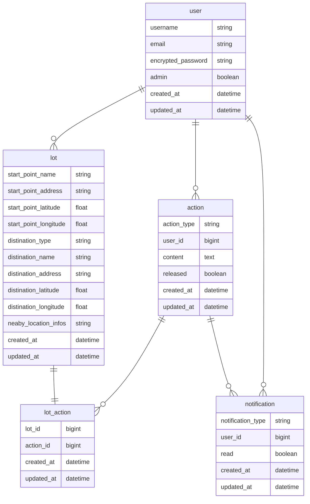

# さんぽくじ（仮称）
## アイデア
- ユーザーが入力した出発地、行先のキーワードを元に、さんぽ旅（行先と目的）を提案してくれるアプリ

## 考案の背景
- 私たちが普段行く範囲は限られていて、新しい場所にいく機会はあまり多くないと思います。身近な場所に観光スポットがあっても気づきづらいことが多く、もったいないなと思っていました。
- そういった意味では、新しい旅先をガチャ形式で提案してくれるPeach航空の[旅くじ](https://www.flypeach.com/campaign/shakelabo/tabikuji/)がすごく良いアイデアだなと感じています。
- ただ、飛行機を使う旅行は日程が長くなりがちで、もっと気軽にいける（数時間〜半日程度で行ける）さんぽ旅をくじ引きの形で提案できるサービスがあれば良いなと考えました。
- Railsを触れる中でCRUDアプリを作る機会はあるのですが、APIを使う機会は少なかったので、外部APIを使ってアプリを作りたいと考えたことも背景の一つです。

## ターゲット
- 散歩などプチお出かけが好きなユーザー
  - いわゆる旅好きなユーザーは近場のお出かけはあまり好まなさそうな印象があります。
- SNSでシェアできるようにしたいので、SNSを利用するユーザー

### 類似のサービス
- [旅くじ](https://www.flypeach.com/campaign/shakelabo/tabikuji/)
- その他で類似サービスは見当たらず、単純なルーレット系のアプリがいくつか存在する。
  - [日本全国 47都道府県のルーレット](https://hajityoro.com/roulette)
  - [旅行先ランダムメーカー](https://kononedan.com/ryokoRandom/)
  - [おひとり様向け。温泉旅行行き先ルーレット](https://shindanmaker.com/1091866)

## 機能の概要（箇条書き）
### 方向性
- アプリのコンテンツがルーレット系であるため、アプリを診断系ツールと位置づけて、アプリ内での履歴閲覧や他ユーザーとの共有機能は最小限（または無し）で良いのではないかと思っています。
### 未ログインでできること
- 行先のタイプを選択し、出発地を入力・送信すると、以下のくじが作成される。
  - 行先（キーワードに応じた近場のスポット）  
  - アクション（行先でチャレンジすること）
    - 予め用意したアクションからランダムで選択されるようにする。自撮りする、おすすめグルメを食べる、など。 
  - 作成したくじはTwitterなどSNSでシェアできる。
- 行先の近場のスポットを併せて提示し、寄り道を勧める。

### ログイン後にできること
- 作成したくじをユーザーに紐付けて保存できる。
- 考案したアクションを作成（提案）できる。
  - 開発元の審査が必要という仕様にした方が良さそう。

### その他
#### 管理ユーザーの機能について
- リソースの管理権限（ユーザー、くじ、アクション）
  - ただし、診断系ツールであるため、実際の運用でCRUD機能を使うことはほとんどなさそう。
- ユーザーから提案されたアクションの内容を確認し、公開できる。
#### 通知機能
- アクションが作成・提案されたとき、管理ユーザーに承認依頼の通知をする。
- アクションが承認されたとき、作成したユーザーに承認完了の通知をする。

#### リリース後などに追加したい機能
- Twitterを使ったログイン
- くじを作成し、結果（詳細画面）が表示されるまでに待ち時間を設けると、（僅かですが）結果を待つワクワク感を期待できるのでは。
  - ベストはガラポンのアニメーションだが、ちょっと難しそう。
  - JSを使った簡単なローディングページをはさみ、３秒程度時間を作ってもう良いかなと思いました。
  - ただ、本番環境にどれだけ課金するか未定ですが、そもそもの読み込み時間が長いと逆効果になりそう。

### 使いそうなAPI
#### 出発地の取得と表示
- Google Maps Javascript API
#### 行先と経路の表示
- Google Place API
- Google Direction API

### 懸念点
- ユーザーが出発前に投稿した場合、それ以降の行動予定をSNSで周知してしまうため、何らかの配慮が必要な気がする。
  - 行先とミッションだけをシェアできるようにし、出発地はシェアしない、など。
- ログイン済ユーザーはアクションを作成できるようにしたいが、開発元の審査が必要な仕様とする。
  - 不適切なアクションを許可しないため。

### アイデア出しについてコメント
- 当初は「公共交通で○○円以下で行けるお出かけ」を提案できるサービスを想定していました。ただ、そういったサービスを提供しているAPIは無く、また実装も厳しそうな印象があったので、上記の内容となりました。
- 上記だけだとサービスとしての面白みに欠ける気もするので、ミッションを尖らせる、またはジャンルを絞ると面白くなりそうです。
  - 少し勇気を必要とするミッション（行先で人と交流する、など）
  - ちょっとオカルトっぽいミッション、など。

### Figma
https://www.figma.com/file/diej53AtUK8CtG908Lva8l/%E3%81%95%E3%82%93%E3%81%BD%E3%81%8F%E3%81%98%EF%BC%88%E4%BB%AE%E7%A7%B0%EF%BC%89?node-id=0%3A1

### ER図の再作成（Mermaid記法）

### エンドポイントとコントローラー
| やりたいこと | HTTPメソッド | エンドポイント | コントローラ#アクション | 
|:-----------|:------------:|:------------:|:------------:|
| ログイン画面を表示 | GET | /login | users/sessions#new |
| ログイン | POST | /login | users/sessions#create |
| ログアウト | DELETE | /logout | users/sessions#destroy |
| くじ作成画面を表示 | GET | /lots/new | lots#new |
| くじを作成 | POST | /lots | lots#create |
| くじの詳細を表示 | GET | /lots/:id | lots#show |
| ユーザー登録画面を表示 | GET | /signup |	users/registrations#new |
| ユーザー登録 | POST | /signup | users/registrations#create |
| ユーザー情報の削除 | DELETE | /users/:id | users/registrations#destroy |
| アクション作成画面を表示 | GET | /actions/new | actions#new |
| アクションを作成 | POST | /actions | actions#create |
| マイページを表示 | GET | /mypage/account | /mypage/account#show |
| マイページの編集画面を表示 | GET | /mypage/account/edit | mypage/account#edit |
| マイページを更新 | PUT/PATCH | /mypage/account | mypage/account#update |
| アクションの詳細を表示 | GET | /mypage/actions/:id | mypage/actions#show |
| アクションの編集画面を表示 | GET | /mypage/actions/:id | mypage/actions#edit |
| アクションを更新 | GET | /mypage/actions/:id | mypage/actions#update |
| アクションを削除 | DELETE | /mypage/actions/:id | mypage/actions#destroy |
| 通知の一覧を表示 | GET | /mypage/notifications | mypage/notifications#index |
| 通知の詳細を表示 | GET | /mypage/notifications/:id | mypage/notifications#show |
| 通知を既読にする | GET | /mypage/notifications/:id/read| mypage/notifications#read |
| （管理画面）ユーザー一覧を表示 | GET | /admin/users | admin/users#index |
| （管理画面）ユーザー情報の詳細を表示 | GET | /admin/users/:id | admin/users#show |
| （管理画面）ユーザー情報の編集ページを表示 | GET | /admin/users/:id/edit | admin/users#edit |
| （管理画面）ユーザー情報を更新 | PUT/PATCH | /admin/users/:id | admin/users#update |
| （管理画面）ユーザー情報を削除 | DELETE | /admin/users/:id | admin/users#destroy |
| （管理画面）くじ一覧を表示 | GET | /admin/lots | admin/lots#index |
| （管理画面）くじ詳細を表示 | GET | /admin/lots/:id | admin/lots#show |
| （管理画面）くじを削除 | DELETE | /admin/lots/:id | admin/lots#destroy |
| （管理画面）アクション一覧を表示 | GET | /admin/actions | admin/actions#index |
| （管理画面）アクション詳細を表示 | GET | /admin/actions/:id | admin/actions#show |
| （管理画面）アクションの編集ページを表示 | GET | /admin/actions/:id/edit | admin/actions#edit |
| （管理画面）アクションを更新 | PUT/PATCH | /admin/actions/:id | admin/actions#update |
| （管理画面）アクションを削除 | DELETE | /admin/actions/:id | admin/actions#destroy |
| 使い方 | GET | /about | static_pages#about |
| さんぽのコツ・ヒントを紹介 | GET | /tips_to_enjoy | static_pages#tips |
| 利用規約 | GET | /rules | static_pages#rules |
| プライバシーポリシー | GET | /privacy | static_pages#privacy |

### 決めていないこと・ご相談したいこと
- 寄り道スポットの情報の管理について
  - lotsのカラム`neaby_location_infos`に持たせるのか、従属するモデルを作成して情報を保存するか。

### その他メモ
- `lot`が作成されたときに、行先でのアクションを保存する`lot_action`をコールバックで作成する。
- `user`の削除については、通常の削除にしようと思います（論理削除ではなく）
  - `user`と`action`の関係は`dependent: :destroy`の予定ですが、actionの候補が消えても影響は軽微と思われるため。